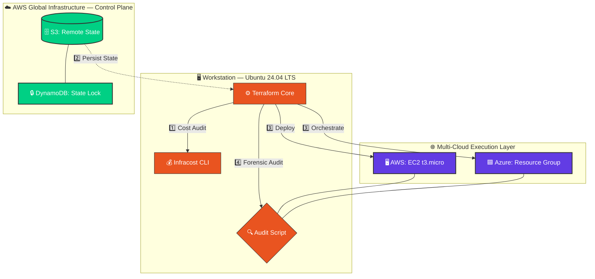
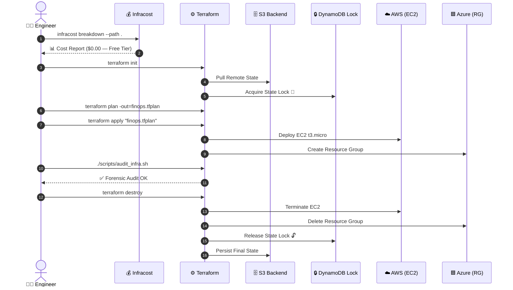

# 🏛️ Cloud-Agnostic FinOps & Governance Framework

> **Architecting Resilient Multi-Cloud Solutions with Zero-Waste Lifecycle Management.**

<div align="center">

[](https://www.terraform.io/)
[](https://www.infracost.io/)
[](https://aws.amazon.com/)
[](https://azure.microsoft.com/)
[](https://ubuntu.com/)
[](LICENSE)
[]()
[]()

</div>

---

## 📌 Tabla de Contenido

- [🎤 Arquitectura en 10 Segundos](#-arquitectura-en-10-segundos)
- [🗺️ Diagrama de Alcance](#%EF%B8%8F-diagrama-de-alcance-solución-multicloud)
- [🔄 Ciclo de Vida del Estado](#-ciclo-de-vida-del-estado-terraform)
- [🛠️ Decisiones de Arquitectura](#%EF%B8%8F-ficha-técnica-decisiones-de-arquitectura)
- [📊 Matriz de Costos FinOps](#-matriz-de-costos-nube-limpia)
- [📖 Runbook Quirúrgico](#-runbook-quirúrgico-lifecycle)
- [📁 Estructura del Proyecto](#-estructura-del-proyecto)
- [🚀 Quickstart](#-quickstart)
- [📬 Contacto](#-contacto--estrategia-profesional)

---

## 🎤 Arquitectura en 10 Segundos

> *"En este laboratorio no solo desplegamos recursos; implementamos **Gobernanza Multicloud con enfoque FinOps**. He diseñado una arquitectura agnóstica capaz de orquestar **AWS y Azure** simultáneamente, garantizando la integridad del estado mediante **State Locking** y prediciendo el impacto financiero con **Shift-Left Cost Analysis** antes de tocar la nube. Esto es infraestructura real, diseñada para el mundo real."*

---

## 🗺️ Diagrama de Alcance (Solución Multicloud)



---

## 🔄 Ciclo de Vida del Estado (Terraform)



---

## 🛠️ Ficha Técnica: Decisiones de Arquitectura

| Categoría | Tecnología | Justificación Estratégica *(Architect View)* |
|:---:|:---:|:---|
| 🔧 **Orquestación** | Terraform (IaC) | Abstracción declarativa para gestión unificada, reproducible y versionable. |
| 🌐 **Estrategia** | Multi-Cloud | Resiliencia operativa y aprovechamiento de servicios nativos por proveedor. |
| 🔒 **Gobernanza** | Remote Backend (S3 + DynamoDB) | Persistencia cifrada con State Locking para garantizar integridad del dato. |
| 💰 **FinOps** | Infracost | Metodología Shift-Left: auditoría preventiva de costos en fase de diseño. |
| 🔍 **Observabilidad** | Custom Bash Audit | Validación forense inmediata sin latencia de consola web. |
| 🟢 **Capa de Costo** | 100% Free Tier | Arquitectura optimizada para experimentación con costo operativo `$0.00`. |

---

## 📊 Matriz de Costos (Nube Limpia)

| Proveedor | Recurso | Tipo | Costo Estimado | Estado Final |
|:---:|:---|:---:|:---:|:---:|
|  | EC2 Instance | `t3.micro` | `$0.00` *(Free Tier)* | 🔴 Destruido |
|  | S3 Storage | `Standard` | `$0.00` *(Free Tier)* | 🔴 Destruido |
|  | DynamoDB | `WCU/RCU` | `$0.00` *(Free Tier)* | 🔴 Destruido |
|  | Resource Group | `Container` | `$0.00` | 🔴 Destruido |
| | | **TOTAL** | **`$0.00 USD`** | ✅ **Tabula Rasa** |

---

## 📖 Runbook Quirúrgico (Lifecycle)

```mermaid
flowchart LR
    A("🚀 START") --> B["1️⃣ create_backend.sh\n🔒 Capa de Persistencia"]
    B --> C["2️⃣ infracost breakdown\n💰 Shift-Left Cost Analysis"]
    C --> D["3️⃣ terraform init\n+ terraform apply\n⚙️ Orquestación Multicloud"]
    D --> E["4️⃣ audit_infra.sh\n🔍 Validación Forense"]
    E --> F["5️⃣ terraform destroy\n+ destroy_backend.sh\n🗑️ Decommissioning"]
    F --> G("✅ TABULA RASA\n$0.00 USD")

    style A fill:#00D084,color:#fff,stroke:none
    style G fill:#00D084,color:#fff,stroke:none
    style B fill:#623CE4,color:#fff,stroke:none
    style C fill:#623CE4,color:#fff,stroke:none
    style D fill:#623CE4,color:#fff,stroke:none
    style E fill:#623CE4,color:#fff,stroke:none
    style F fill:#E95420,color:#fff,stroke:none
```



### Comandos por Fase

```bash
# ─────────────────────────────────────────────
# FASE 1 — Gobernanza: Capa de Persistencia
# ─────────────────────────────────────────────
chmod +x scripts/create_backend.sh
./scripts/create_backend.sh

# ─────────────────────────────────────────────
# FASE 2 — FinOps: Shift-Left Cost Breakdown
# ─────────────────────────────────────────────
infracost breakdown --path terraform/environments/prod

# ─────────────────────────────────────────────
# FASE 3 — Orquestación: Despliegue Multicloud
# ─────────────────────────────────────────────
cd terraform/environments/prod
terraform init
terraform plan -out=finops.tfplan
terraform apply "finops.tfplan"

# ─────────────────────────────────────────────
# FASE 4 — Observabilidad: Auditoría Forense
# ─────────────────────────────────────────────
./scripts/audit_infra.sh

# ─────────────────────────────────────────────
# FASE 5 — Decommissioning: Safety Guardrail
# ─────────────────────────────────────────────
terraform destroy
./scripts/destroy_backend.sh
```

---

## 📁 Estructura del Proyecto

```
📦 cloud-agnostic-finops/
├── 📂 terraform/
│   ├── 📂 environments/
│   │   └── 📂 prod/
│   │       ├── main.tf           # Configuración principal
│   │       ├── variables.tf      # Variables de entrada
│   │       ├── outputs.tf        # Outputs del deployment
│   │       └── backend.tf        # Remote State (S3 + DynamoDB)
│   ├── 📂 modules/
│   │   ├── 📂 aws-compute/       # Módulo EC2
│   │   └── 📂 azure-governance/  # Módulo Resource Group
│   └── finops.tfplan             # Plan pre-auditado (Infracost)
├── 📂 scripts/
│   ├── create_backend.sh         # Provisioning del backend remoto
│   ├── destroy_backend.sh        # Decommissioning seguro
│   └── audit_infra.sh            # Validación forense de recursos
├── 📂 docs/
│   └── architecture.md           # Decisiones de diseño (ADR)
├── .infracost/                    # Cache de estimaciones FinOps
├── .gitignore
└── README.md
```

---

## 🚀 Quickstart

### Prerrequisitos

```bash
# Terraform >= 1.5
terraform --version

# Infracost CLI
infracost --version

# AWS CLI configurado
aws configure

# Azure CLI autenticado
az login
```

### Instalación en 5 Pasos

```bash
# 1. Clonar el repositorio
git clone https://github.com/tu-usuario/cloud-agnostic-finops.git
cd cloud-agnostic-finops

# 2. Provisionar backend remoto (S3 + DynamoDB)
./scripts/create_backend.sh

# 3. Auditar costos ANTES de desplegar (Shift-Left FinOps)
infracost breakdown --path terraform/environments/prod

# 4. Inicializar y desplegar infraestructura
cd terraform/environments/prod
terraform init && terraform plan -out=finops.tfplan
terraform apply "finops.tfplan"

# 5. Validar recursos vivos (Forensic Audit)
./scripts/audit_infra.sh
```

---

## 📬 Contacto & Estrategia Profesional

<div align="center">

> *Si buscas escalar infraestructuras con **visibilidad total** y **gobernanza de clase mundial**, hablemos.*

[](https://linkedin.com/in/tu-usuario)
[](https://github.com/tu-usuario)
[](https://tiktok.com/@tu-usuario)

</div>

---

<div align="center">

**Este proyecto fue diseñado y ejecutado bajo una política de `Zero-Waste`,**
**garantizando una huella financiera neutral.**


*Made with 🏛️ Architecture + 💰 FinOps + ☁️ Multi-Cloud*

</div>

