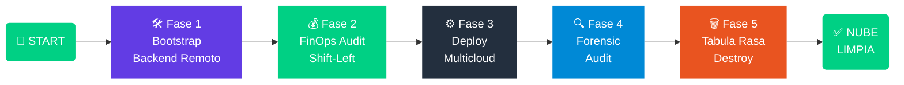
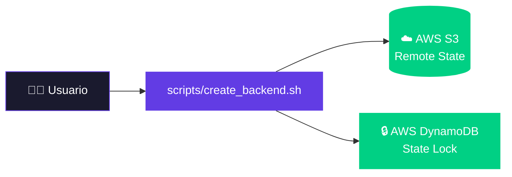
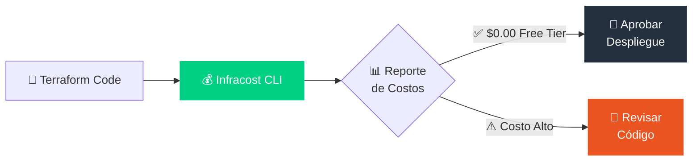
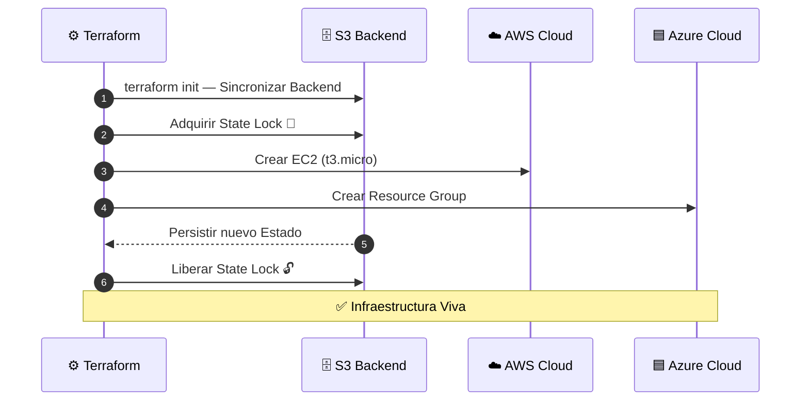
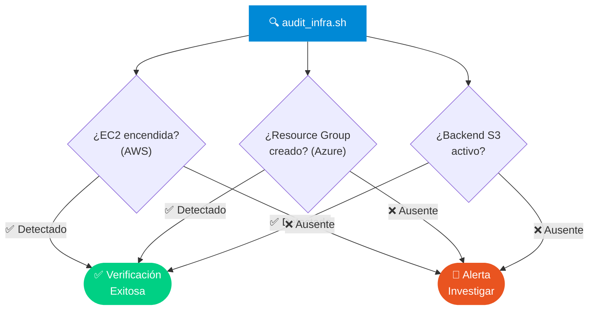
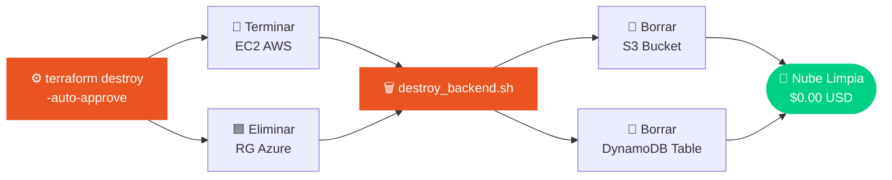

# 📖 Runbook: Operación Multi-Cloud FinOps

> **Guía de Ejecución Quirúrgica para el Despliegue y Desmantelamiento de Infraestructura.**

<div align="center">

[]()
[]()
[]()
[]()
[]()

</div>

> [!IMPORTANT]
> Este documento es la **única fuente de verdad** para operar el framework.
> Sigue el orden de fases **estrictamente** para garantizar la integridad del Remote State y la Gobernanza Financiera.

---

## 📌 Tabla de Contenido

- [🔄 Visión General del Pipeline](#-visión-general-del-pipeline)
- [🛠️ Fase 1 — Bootstrap](#%EF%B8%8F-fase-1-preparación-del-entorno-bootstrap)
- [💰 Fase 2 — FinOps Audit](#-fase-2-auditoría-finops-shift-left)
- [⚙️ Fase 3 — Deploy](#%EF%B8%8F-fase-3-despliegue-multicloud-execution)
- [🔍 Fase 4 — Forensic Audit](#-fase-4-auditoría-forense-post-deploy)
- [🗑️ Fase 5 — Tabula Rasa](#%EF%B8%8F-fase-5-desmantelamiento-seguro-tabula-rasa)
- [🚩 Troubleshooting](#-solución-de-problemas-troubleshooting)

---

## 🔄 Visión General del Pipeline



---

## 🛠️ Fase 1: Preparación del Entorno (Bootstrap)


**Propósito:** Establecer la "Capa de Persistencia" en la nube. Sin esta fase, Terraform no tendría dónde guardar su memoria (Estado) de forma segura.



### Pasos de Ejecución

**1.** Abrir la terminal en la raíz del proyecto:
```bash
cd cloud-agnostic-finops-framework
```

**2.** Otorgar permisos de ejecución a los scripts:
```bash
chmod +x scripts/*.sh
```

**3.** Ejecutar el provisionamiento del Backend:
```bash
./scripts/create_backend.sh
```

> [!NOTE]
> **¿Por qué este paso?** Creamos un bucket S3 único usando tu **Account ID de AWS** y una tabla DynamoDB. Esto evita que dos procesos modifiquen el estado de la nube simultáneamente *(State Locking)*.

---

## 💰 Fase 2: Auditoría FinOps (Shift-Left)


**Propósito:** Saber cuánto costará la infraestructura **antes de que exista**. Es el pilar de la responsabilidad financiera.



### Pasos de Ejecución

**1.** Configurar la API Key *(solo la primera vez)*:
```bash
infracost configure set api_key TU_CLI_TOKEN_AQUI
```

**2.** Generar el desglose de costos:
```bash
infracost breakdown --path terraform/environments/prod
```

> [!TIP]
> **Validación:** El reporte puede mostrar nominalmente ~`$8 USD`, pero el costo real en la factura de AWS es **`$0.00`** gracias al Free Tier. Verifica que los recursos sean `t3.micro`, `S3 Standard` y `DynamoDB on-demand`.

---

## ⚙️ Fase 3: Despliegue Multicloud (Execution)


**Propósito:** Transformar el código HCL en recursos reales en AWS y Azure de forma **atómica**.



### Pasos de Ejecución

**1.** Entrar al directorio de producción:
```bash
cd terraform/environments/prod
```

**2.** Inicializar Terraform y conectar al Backend remoto:
```bash
terraform init
```

**3.** Planificar y guardar el plan auditado:
```bash
terraform plan -out=finops.tfplan
```

**4.** Aplicar el plan:
```bash
terraform apply "finops.tfplan"
```

> [!NOTE]
> Usar `-out=finops.tfplan` garantiza que lo que se **planificó** es exactamente lo que se **aplica**. Nunca ejecutes `terraform apply` sin un plan previo en entornos de producción.

---

## 🔍 Fase 4: Auditoría Forense (Post-Deploy)


**Propósito:** Validar que la **realidad de la nube** coincide con lo que el arquitecto diseñó. Sin este paso, el despliegue no está verificado.



### Pasos de Ejecución

**1.** Regresar a la raíz del proyecto:
```bash
cd ../../../
```

**2.** Ejecutar el auditor forense:
```bash
./scripts/audit_infra.sh
```

> [!IMPORTANT]
> **Validación:** Todos los checks deben aparecer en **Verde** `(Detectado/OK)`. Si alguno falla, **no continúes** a la Fase 5 hasta investigar la causa.

---

## 🗑️ Fase 5: Desmantelamiento Seguro (Tabula Rasa)


**Propósito:** Eliminar cada rastro de la infraestructura para garantizar el **Zero-Waste** y evitar cargos accidentales.



### Pasos de Ejecución *(Orden Crítico)*

**1.** Destruir los recursos gestionados por Terraform:
```bash
cd terraform/environments/prod
terraform destroy -auto-approve
```

**2.** Destruir la Capa de Persistencia *(regresar a la raíz primero)*:
```bash
cd ../../../
./scripts/destroy_backend.sh
```

**3.** Validación Final — Confirmar estado limpio:
```bash
./scripts/audit_infra.sh
# ✅ Todo debe aparecer como: Ausente
```

> [!WARNING]
> **Nota de Seguridad:** El script `destroy_backend.sh` te pedirá escribir `ELIMINAR` para confirmar. Este paso es **irreversible** y borra toda la trazabilidad del estado remoto. Procede con absoluta certeza.

---

## 🚩 Solución de Problemas (Troubleshooting)

| # | Error Común | Causa | Solución |
|:---:|:---|:---|:---|
| 1 | `InvalidAMIID.NotFound` | La imagen de Ubuntu cambió en la región. | El código usa **Data Sources dinámicos**; solo corre `terraform plan` de nuevo. |
| 2 | `AccessDenied` | Credenciales expiradas o sin permisos. | Ejecuta `aws configure` o `az login` para refrescar los tokens. |
| 3 | `BucketAlreadyExists` | El nombre del bucket ya está tomado globalmente. | El script usa el **Account ID de AWS**, lo que garantiza unicidad global. Si persiste, verifica la región. |
| 4 | `StateLockError` | Proceso anterior no liberó el lock. | Ejecuta `terraform force-unlock <LOCK_ID>` con precaución. |
| 5 | `ResourceGroupNotFound` | Azure CLI no autenticado. | Ejecuta `az login` y verifica la suscripción activa con `az account show`. |

---

<div align="center">

---

*Firmado por:*
**Arquitectura de Soluciones — Framework FinOps Multicloud**


</div>

